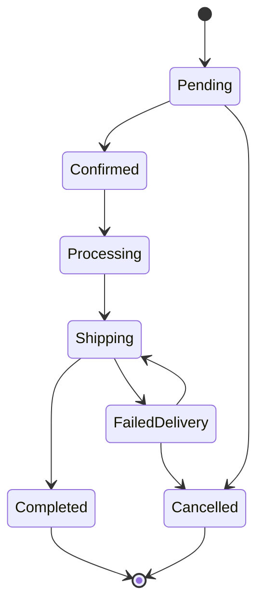

# Ecommerce MVP Overview

## 1. Mục đích dự án

Xây dựng MVP demo cho hệ thống e-commerce bán sản phẩm setup góc làm việc tương tự HyperWork, tập trung vào các luồng cốt lõi:

- Khách xem sản phẩm
- Thêm sản phẩm vào giỏ hàng
- Đặt hàng
- Admin quản lý sản phẩm và đơn hàng

MVP cần đủ đơn giản để triển khai nhanh, nhưng kiến trúc phải rõ ràng để có thể mở rộng về sau như loyalty, bảo hành, B2B, lắp đặt, thanh toán online.

---

## 2. Người dùng chính

### Customer

Người dùng mua hàng trên website.

#### Chức năng chính

- Xem trang chủ
- Xem danh mục sản phẩm
- Xem chi tiết sản phẩm
- Chọn biến thể sản phẩm
- Thêm vào giỏ hàng
- Checkout
- Tra cứu đơn hàng

### Admin

Người vận hành hệ thống.

#### Chức năng chính

- Đăng nhập admin
- Quản lý danh mục
- Quản lý sản phẩm
- Quản lý biến thể/SKU
- Quản lý tồn kho cơ bản
- Quản lý đơn hàng
- Cập nhật trạng thái đơn hàng
- Quản lý banner trang chủ

---

## 3. Phạm vi MVP

### Có trong MVP

- Storefront cho khách hàng
- Admin portal
- Product catalog
- Product variant/SKU
- Cart
- Guest checkout
- Order management
- Basic inventory
- Basic banner/content
- Basic dashboard

## 4. Chức năng Storefront

### Home Page

- Hiển thị banner
- Hiển thị danh mục nổi bật
- Hiển thị sản phẩm nổi bật

### Product Listing Page

- Danh sách sản phẩm theo danh mục
- Tìm kiếm cơ bản theo tên sản phẩm
- Lọc cơ bản theo:
  - Danh mục
  - Giá
  - Trạng thái còn hàng

### Product Detail Page

- Tên sản phẩm
- Hình ảnh
- Giá bán
- Giá gốc nếu có
- Mô tả
- Thông số kỹ thuật
- Danh sách biến thể/SKU
- Tồn kho
- Cờ yêu cầu lắp đặt `RequiresInstallation`

### Cart

- Thêm sản phẩm vào giỏ
- Cập nhật số lượng
- Xóa sản phẩm khỏi giỏ
- Tính tổng tiền

### Checkout

#### Thông tin người nhận

- Họ tên
- Số điện thoại
- Email
- Địa chỉ giao hàng
- Ghi chú

#### Phương thức thanh toán

- COD
- Chuyển khoản thủ công

### Order Lookup

Tra cứu đơn hàng bằng:

- Mã đơn hàng
- Số điện thoại

---

## 5. Chức năng Admin

### Authentication

- Admin đăng nhập bằng email/password
- Chưa cần phân quyền phức tạp trong MVP

### Category Management

- Tạo danh mục
- Cập nhật danh mục
- Ẩn/hiện danh mục
- Hỗ trợ danh mục cha/con

### Product Management

- Tạo sản phẩm
- Cập nhật sản phẩm
- Ẩn/hiện sản phẩm
- Gán danh mục
- Quản lý mô tả
- Quản lý ảnh
- Quản lý thông số kỹ thuật

### Product Variant Management

Quản lý:

- SKU code
- Tên biến thể
- Màu sắc
- Kích thước
- Giá bán
- Giá gốc
- Tồn kho
- Trạng thái active
- RequiresInstallation

### Order Management

- Xem danh sách đơn hàng
- Xem chi tiết đơn hàng
- Cập nhật trạng thái đơn hàng
- Ghi chú nội bộ
- Xem lịch sử trạng thái đơn

### Banner Management

- Tạo banner
- Cập nhật banner
- Ẩn/hiện banner
- Sắp xếp thứ tự hiển thị

### Dashboard

- Tổng số đơn hàng
- Tổng doanh thu
- Số đơn mới
- Sản phẩm sắp hết hàng

---

## 6. Trạng thái đơn hàng MVP



### Order Status

| Status         | Mô tả              |
| -------------- | ------------------ |
| Pending        | Đơn mới tạo        |
| Confirmed      | Admin đã xác nhận  |
| Processing     | Đang chuẩn bị hàng |
| Shipping       | Đang giao hàng     |
| Completed      | Hoàn tất           |
| FailedDelivery | Giao thất bại      |
| Cancelled      | Đã hủy             |

---

## 7. Module chính

### Catalog Module

Quản lý:

- Category
- Product
- ProductVariant
- ProductImage
- ProductSpecification

### Cart Module

Quản lý:

- Cart
- CartItem

### Ordering Module

Quản lý:

- Order
- OrderItem
- OrderStatusHistory

### Customer Module

Quản lý:

- Customer
- Customer Contact Info
- Guest Customer Data

### Inventory Module

MVP:

- ProductVariant.StockQuantity

Mở rộng tương lai:

- Warehouse
- InventoryStock
- StockMovement

### Content Module

Quản lý:

- Banner
- Static Content

---

## 8. Business Rules quan trọng

- Không xóa cứng sản phẩm đã có đơn hàng.
- Product, Category, Variant dùng `IsActive` để ẩn/hiện.
- Mỗi sản phẩm có thể có nhiều Variant/SKU.
- Tồn kho quản lý theo SKU.
- Checkout phải snapshot dữ liệu sản phẩm vào OrderItem.
- Giá đơn hàng không phụ thuộc giá hiện tại của sản phẩm.
- Trừ tồn kho khi xác nhận hoặc tạo đơn tùy cấu hình.
- Mỗi lần đổi trạng thái phải ghi vào OrderStatusHistory.
- Guest checkout lưu trực tiếp thông tin người nhận vào Order.
- Không đặt business logic trong Controller.

---

## 9. Data Model cốt lõi

### Customer

```text
Id
FullName
PhoneNumber
Email
CreatedAt
```

### Category

```text
Id
ParentId
Name
Slug
IsActive
SortOrder
```

### Product

```text
Id
CategoryId
Name
Slug
Description
IsFeatured
IsActive
CreatedAt
UpdatedAt
```

### ProductVariant

```text
Id
ProductId
Sku
Name
Color
Size
Price
CompareAtPrice
StockQuantity
RequiresInstallation
IsActive
```

### ProductImage

```text
Id
ProductId
ImageUrl
AltText
SortOrder
```

### ProductSpecification

```text
Id
ProductId
Name
Value
SortOrder
```

### Cart

```text
Id
CustomerId
SessionId
CreatedAt
UpdatedAt
```

### CartItem

```text
Id
CartId
ProductVariantId
Quantity
UnitPriceSnapshot
```

### Order

```text
Id
OrderCode
CustomerId
CustomerName
CustomerPhone
CustomerEmail
ShippingAddress
Note
Subtotal
ShippingFee
DiscountAmount
TotalAmount
Status
PaymentMethod
CreatedAt
UpdatedAt
```

### OrderItem

```text
Id
OrderId
ProductVariantId
ProductNameSnapshot
SkuSnapshot
UnitPrice
Quantity
RequiresInstallation
```

### OrderStatusHistory

```text
Id
OrderId
FromStatus
ToStatus
Note
ChangedBy
ChangedAt
```

### Banner

```text
Id
Title
ImageUrl
LinkUrl
SortOrder
IsActive
```

---

## 10. Tech Stack đề xuất

### Backend

- ASP.NET Core 10 Web API, Clean Architecture
- Entity Framework Core
- PostgreSQL
- FluentValidation
- JWT Authentication
- Swagger/OpenAPI

### Frontend

- Reactjs
- TypeScript
- Tailwind CSS
- React Hook Form
- Zod Validation

### Admin Portal

Một trong hai hướng:

- React + Ant Design
- Blazor Server

Khuyến nghị:

- React + Ant Design

### Database

- PostgreSQL (ưu tiên)

### Storage

#### MVP

- Local File Storage

#### Production

- S3-Compatible Storage
- Azure Blob Storage
- Cloudflare R2

### Deployment

- Docker Compose
- Backend Container
- Frontend Container
- Database Container

---

## 11. Kiến trúc đề xuất

**Modular Monolith**

---

## 13. API nhóm chính

### Storefront APIs

```http
GET    /api/categories
GET    /api/products
GET    /api/products/{slug}
POST   /api/cart/items
PUT    /api/cart/items/{id}
DELETE /api/cart/items/{id}
GET    /api/cart
POST   /api/checkout
GET    /api/orders/lookup
```

### Admin APIs

```http
POST   /api/admin/auth/login

GET    /api/admin/categories
POST   /api/admin/categories
PUT    /api/admin/categories/{id}

GET    /api/admin/products
POST   /api/admin/products
PUT    /api/admin/products/{id}

POST   /api/admin/products/{id}/variants
PUT    /api/admin/variants/{id}

GET    /api/admin/orders
GET    /api/admin/orders/{id}
PUT    /api/admin/orders/{id}/status

GET    /api/admin/dashboard

GET    /api/admin/banners
POST   /api/admin/banners
PUT    /api/admin/banners/{id}
```

---

## 14. Coding Guidelines

- Controller chỉ nhận request và trả response.
- Business logic đặt trong Application Service.
- Không dùng Fat Controller.
- Không query database trực tiếp từ Controller.
- Entity không phụ thuộc EF Core nếu có thể.
- Validate bằng FluentValidation.
- API response thống nhất format.
- DTO riêng cho Request/Response.
- Không expose Entity trực tiếp ra API.
- Dùng Migration quản lý Database Schema.
- Viết test cho:
  - Checkout
  - Order Status
  - Inventory Logic

---

## 15. Ưu tiên triển khai

### Phase 1

- Setup Solution
- Database Schema
- Catalog APIs
- Admin Category/Product Management

### Phase 2

- Storefront Product Listing
- Product Detail
- Cart
- Checkout
- Create Order

### Phase 3

- Admin Order Management
- Order Status History
- Dashboard
- Banner Management

### Phase 4

- Polish UI
- Seed Data
- Docker Compose
- Demo Script

---

## 16. Tiêu chí hoàn thành MVP

MVP được xem là hoàn thành khi:

- Admin tạo được danh mục, sản phẩm và SKU.
- Khách xem được sản phẩm trên storefront.
- Khách thêm sản phẩm vào giỏ.
- Khách checkout thành công.
- Hệ thống tạo đơn hàng có mã đơn.
- Admin xem và cập nhật trạng thái đơn.
- Khách tra cứu được đơn hàng.
- Tồn kho được cập nhật cơ bản.
- Source code chia module rõ ràng.
- Có seed data để demo.
